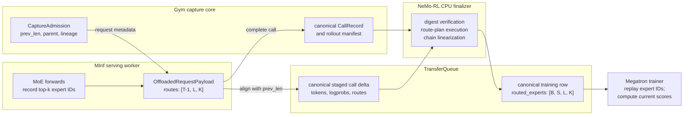

# Token Capture Lineage Ledger

Exact-token capture for blackbox agentic rollouts is coordinated by a single
per-rollout **capture ledger**: NeMo Gym's `LineageStore`, extended so that its
append-only JSONL rows are simultaneously the request-time lineage index and
the token-free record of rollout capture state. There is no separate gate
state machine; serving workers coordinate only through the ledger, and NeMo RL
(the rollout owner) assembles the `RolloutReceipt` itself at rollout end.

The external staging contract (`StagingSink` / `StagingSource`), the vLLM
worker capture path, and the `verify_and_linearize()` trust boundary are
unchanged from the worker-custody design. The recipe exercising this path end
to end is [Nano SWE with Token Capture](../guides/nano-swe-token-capture.md);
the verification trust boundary is described in
[Rollout Verification Boundary](rollout-verification-boundary.md).

## Why a ledger and not a gate

An earlier iteration paired the lineage store with a `RolloutCaptureGate` and
a cross-process `GateStateStore`. The gate did not provide a second lineage
algorithm — parent resolution ran upstream through `LineageStore.resolve()`,
and the gate cross-checked that result against its own copy of the call state,
storing each call's cumulative token IDs **twice** (gate state + lineage
JSONL). Its file-backed state store also serialized the entire global gate
state — every live rollout's cumulative token arrays — under one exclusive
lock, three transactions per model call.

Everything the gate legitimately provided — admission, rollout completeness,
terminal selection, cleanup — is either a pure function of the lineage result
or belongs to the framework that already owns the rollout. So each
responsibility moved to its natural owner and the redundant state machine was
deleted.

## The ledger

`FileLineageStore` writes one locked, fsynced JSONL row per committed call.
In external-staging mode (`token_id_capture.external_staging: true`) each row
additionally carries the token-free `CallRecord` custody columns —
`parent_call_id`, `staging_key`, `weight_version`, `prev_len` / `delta_len` /
`cum_len`, the staged record's `digest` and `extras_digest`, `mode`, and
`logical_request_id` (the client header when present, else the vLLM response
id). Three surfaces make it the single record of capture state (the
`CaptureLedger` protocol):

- `record(...)` — the extended commit row, written by the model server's
  commit hook after the worker's `CommitCoords` arrive.
- `record_failure(rollout_id, model_call_id, reason)` — a poison row for a
  call whose capture did not commit. Failure rows carry no fingerprint, so
  `resolve()` can never return them as parents.
- `manifest(rollout_id)` — the token-free read-back (committed rows +
  failures), exposed over one bearer-protected control route:
  `GET /training-token-capture/rollouts/{rollout_id}/manifest`.

`InMemoryLineageStore` cannot serve the ledger role: its resolution index
evicts rollouts under memory bounds, which is fine for a cache but not for a
completeness record. External staging requires a non-evicting store and
rejects the in-memory store at startup.

## Admission is a pure function

When external staging is enabled, `resolve_parent()` builds the
`CaptureAdmission` directly from the lineage result — a strict tri-state:

| Lineage outcome | Admission |
| --- | --- |
| `ROOT` — empty assistant fingerprint, or unmatched fingerprint on a rollout with no ledger rows (seeded assistant history) | `text` mode, no parent |
| `MATCH` — unique fingerprint match with verified context digest | `token_in` mode, the parent's ordered `staging_chain`, cumulative length, and chain hash |
| `UNRESOLVED` — non-empty fingerprint with no match, ambiguity, or digest mismatch | no admission; `record_failure()` poisons the call |

`UNRESOLVED` is never silently converted into a new root: doing so would turn
earlier policy-generated tokens into mask-zero prompt tokens and corrupt the
training row. The completion still serves the agent; only training capture is
poisoned.

## Commit ordering

The invariant the external sink requires — *a call must not become a lineage
parent until its staged record is durable* — holds structurally: the worker
stages through `StagingSink.stage()` before acknowledging, coordinates exist
only after the bytes are durable, and the ledger row (which is what makes a
call resolvable as a parent) is written only after the coordinates arrive.
On `disposition == "staged"` the commit hook appends the token-free coordinates
and lineage witnesses to the ledger. On `capture_failed`, missing coordinates,
or any acknowledgement error it appends a failure row instead. A request that
dies after admission is poisoned from the capture middleware's `finally` hook.

### Megatron Inference payload staging

MInf now uses the same canonical durability boundary through two generic engine
hooks. These hooks (`DynamicInferenceEngine.payload_stager` /
`prompt_preparer`, the `RequestPayloadStager` protocol, and the prefix-splice
request metadata) come from
[NVIDIA/Megatron-LM PR #7015](https://github.com/NVIDIA/Megatron-LM/pull/7015)
and are not yet in the Megatron-LM pinned through Megatron-Bridge; setup fails
with a `NotImplementedError` naming that dependency until the pin is bumped.

Gym's complete `CaptureAdmission` travels as opaque request metadata.
Before engine admission, the model-parallel coordinator resolves an admitted
`staging_chain` through `TQTokenSource`, splices the exact parent tokens into
the rendered prompt, and broadcasts that prepared request to every rank. When
generation completes, the coordinator passes that admission, the exact
`OffloadedRequestPayload`, and the finished request's policy epoch to
`TQMegatronTokenStager`.

The stager invokes Gym's engine-neutral `RolloutTokenCapture`, which constructs
the canonical delta and writes it through the same `TQTokenSink` used by vLLM.
Only after that write returns does MInf attach `ng_commit_coords` to the HTTP
response. Gym consequently commits an ordinary token-free `CallRecord` before
the response is released to the agent. No local metadata ledger or rollout-end
conversion is involved in the active path.

### MInf router replay

When `policy.router_replay.enabled=true`, MInf records the selected top-k
expert identities for every MoE layer. Its native payload has shape
`[T - 1, L, K]`: the last sampled token has no row because it never enters a
subsequent inference forward pass. Gym's staging contract instead requires
one route row for each token in the call delta.

The canonical MInf stager owns both that payload and Gym's admission, including
`prev_len`. Before committing the call it appends an all-`-1` terminal row to
form `[T, L, K]`, then slices `routes[prev_len:]`. The result has exactly
`delta_len` rows and is committed as the call's digest-bound `routed_experts`
extra. `-1` is the replay fallback sentinel: at that position the trainer lets
its current router select experts. This deliberately differs from vLLM, which
uses an in-range placeholder for its terminal row. All other positions normally
reuse MInf's expert identities while still computing the current policy's
router scores and probabilities for those experts. One multi-turn exception is
the parent call's last sampled token: MInf records its real route while
prefilling the child request at `prev_len - 1`, but the child's
`routes[prev_len:]` delta slice drops that row, so the already-committed parent
position remains `-1` and falls back to the current router.

MInf currently does not support
`token_capture.defer_routed_experts_to_policy=true`. The default (`false`)
executes the route plan in the finalizer and publishes the aligned tensor in
the canonical training row.

## Framework-owned receipt and cleanup

NeMo RL fetches the manifest at rollout end and assembles the receipt locally.
For vLLM:

- `manifest` = the fetched `CallRecord` list, deduped by `model_call_id`;
- `terminal_model_call_id` = the row whose `logical_request_id` matches the
  rollout's reported terminal logical request (a response id);
- `capture_poisoned` = any failure row present, or no row for the terminal
  request.

MInf and vLLM both produce committed `manifest` rows that point directly to
canonical TQ records.

Terminal selection has a strict precedence: **declared > heuristic > mask**. A
harness-declared terminal is authoritative — a declared id that matches no
committed row masks the rollout and never falls back. When the harness reports
no terminal at all, Gym's `select_terminal_call` infers one from the
manifest's explicit parent links (earliest-admitted root by `admitted_at`, an
extended sibling beating an abandoned childless retry); any ambiguous shape —
a retry of the final call, divergent extended branches — masks with the
selection reason. The heuristic only chooses *among* digest-verified rows:
`verify_and_linearize` still verifies the chosen chain. The receipt records
the path in `terminal_selection` and the finalizer emits
`finalize/heuristic_terminal_fraction` per group.

`verify_and_linearize(receipt, snapshots)` runs unchanged. Retry duplicates
appear as dead-branch sibling rows in the manifest: their staged rows are
fetched, verified, and cleaned like any other, but they never join the
terminal chain (`_validate_manifest_graph` tolerates rows unreferenced by the
terminal chain). Cleanup is manifest-enumerated in the finalizer; an abandoned
dispatch's staged rows are swept with the staging partition at run end (there
is no prefix-clear primitive in the data plane yet).

## Failure semantics (all fail-closed)

- **Capture fails mid-rollout:** the model call still succeeds for the agent;
  a failure row is written. Later calls miss resolution → `UNRESOLVED` →
  more failure rows. Finalization sees failure rows → poisoned → masked
  placeholder row (the group still publishes exactly N rows).
- **Terminal response lost, harness retries:** the retry is a sibling row
  (per-request `uuid4` identity). The harness reports the retry's response id,
  so receipt assembly selects the retry's row; the lost attempt is a dead
  branch. An ambiguous mid-rollout sibling (identical regenerated text)
  poisons via `UNRESOLVED` instead of silently becoming a root.
- **Crash after staging, before the ledger append:** descendants resolve
  `UNRESOLVED` and poison; a terminal orphan poisons via the missing terminal
  row.

Retry *idempotency* (harness-minted logical request ids + deterministic
`model_call_id`, collapsing identical retries into the same row instead of
poisoning) is an explicit follow-up; no retry outcome is silently wrong today.
